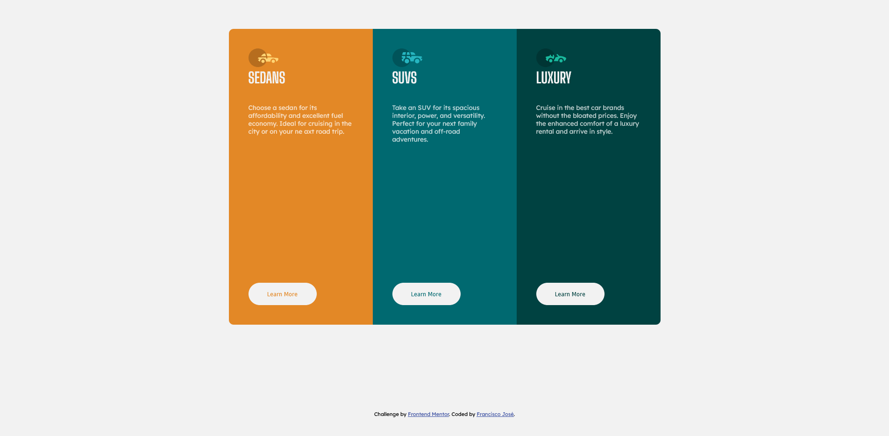
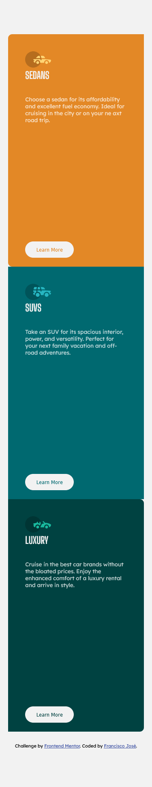

# Frontend Mentor - 3-column preview card component solution [![Build Status]]

This is a solution to the [3-column preview card component challenge on Frontend Mentor] 
(https://www.frontendmentor.io/challenges/3column-preview-card-component-pH92eAR2-). Frontend Mentor challenges help you improve your coding skills by building realistic projects. 


## Table of contents

- [Overview](#overview)
  - [The challenge](#the-challenge)
  - [Screenshot](#screenshot)
  - [Links](#links)
- [My process](#my-process)
  - [Built with](#built-with)
  - [What I learned](#what-i-learned)
  - [Useful resources](#useful-resources)
- [Author](#author)

## Overview

### The challenge

Users should be able to:

- View the optimal layout depending on their device's screen size
- See hover states for interactive elements

### Screenshot





### Links

- Solution URL: [Add solution URL here](https://your-solution-url.com)
- Live Site URL: [Add live site URL here](https://your-live-site-url.com)

## My process

### Built with

- Semantic HTML5 markup
- CSS custom properties
- Flexbox
- Mobile-first workflow
- Media Queries

### What I learned

I've learned to keep it simple by using the name of elements instead of classes or to use it only when necessary. I also tried to work with elements and their hierarchy. Like the snippet below:

```
    section{}
    section article{}
    article{}
    article h1{}
    article p{}
    footer{}
    footer a{}
```

I've also used an elegant way to address the elements by using the css method **first-child  and last-child**. In the case of the middle element I used the **nth-child(n)** method. Where I manipulated using **n+2**, since **n** would be **zero** it would add with **two** and I could manipulate the middle element.

```
section article:first-child {}
section article:nth-child(n+2) {}
section article:last-child {}
```
In HTML I wanted to make it semantical so I changed all the **divs** to HTML elements. That way it could work with screen readers. 


```
        <article>
            
            <h1>Sedans</h1>
            <p> Choose a sedan for its affordability and excellent fuel economy. Ideal for cruising in the city or on your ne axt road trip.</p>
            <button class="btn-sedans" >Learn More</button>
        </article>
```


As for the font size I used two measurements. The first was in **pixels** and the second one was is **rem**. That way the text will always look like I've imagined it.

In addittion I also learned to desing for different screen sizes. The challenge was to make the layout work on Small Screen Devices the same way it did on Desktop. 

### Useful resources

- [A Complete Guide to Flexbox
](https://css-tricks.com/snippets/css/a-guide-to-flexbox/) - This helped me for the work better with flexbox and also understand how the parents and children elements work.

## Author

- Frontend Mentor - [@fcoxico](https://www.frontendmentor.io/profile/fcoxico)
- Linkedin - [@franciscojcardoso/](https://www.linkedin.com/in/franciscojcardoso)